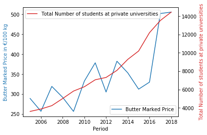

```python
import numpy as np
import pandas as pd
import matplotlib.pyplot as plt

def handle_missingValues_simple(incomplete_data):

    complete_data = incomplete_data.fillna(method='bfill').fillna(method='ffill')
    return complete_data

def handle_outliers(noisy_data):

    cleaned_data=noisy_data
    for column in cleaned_data:
        cleaned_data[column] = cleaned_data[column].rolling(window=2,center=True).median().fillna(method='bfill').fillna(method='ffill')
    return cleaned_data

```


```python
productprices = pd.read_csv(open("data/market-prices-all-products_en.csv", "r"), encoding='utf-8', engine='c', header=0)
productprices=productprices.set_index('Country')
productprices=handle_missingValues_simple(productprices)
productprices=handle_outliers(productprices)
productprices.head()
```


<div>
<style scoped>
    .dataframe tbody tr th:only-of-type {
        vertical-align: middle;
    }

    .dataframe tbody tr th {
        vertical-align: top;
    }

    .dataframe thead th {
        text-align: right;
    }
</style>
<table border="1" class="dataframe">
  <thead>
    <tr style="text-align: right;">
      <th></th>
      <th>"Category"</th>
      <th>Sector code</th>
      <th>Product code</th>
      <th>Product desc</th>
      <th>Product Brief Description</th>
      <th>Unit</th>
      <th>Period</th>
      <th>MP Market Price</th>
    </tr>
    <tr>
      <th>Country</th>
      <th></th>
      <th></th>
      <th></th>
      <th></th>
      <th></th>
      <th></th>
      <th></th>
      <th></th>
    </tr>
  </thead>
  <tbody>
    <tr>
      <th>AT</th>
      <td>Animal products</td>
      <td>OEV</td>
      <td>0207 11 30</td>
      <td>Chicken</td>
      <td>Broiler - Poulet, 65%</td>
      <td>€/100 kg carcass weight</td>
      <td>201903.0</td>
      <td>199.200</td>
    </tr>
    <tr>
      <th>BE</th>
      <td>Animal products</td>
      <td>OEV</td>
      <td>0207 11 30</td>
      <td>Chicken</td>
      <td>Broiler - Poulet, 65%</td>
      <td>€/100 kg carcass weight</td>
      <td>201903.0</td>
      <td>199.200</td>
    </tr>
    <tr>
      <th>BG</th>
      <td>Animal products</td>
      <td>OEV</td>
      <td>0207 11 30</td>
      <td>Chicken</td>
      <td>Broiler - Poulet, 65%</td>
      <td>€/100 kg carcass weight</td>
      <td>201903.0</td>
      <td>159.055</td>
    </tr>
    <tr>
      <th>CY</th>
      <td>Animal products</td>
      <td>OEV</td>
      <td>0207 11 30</td>
      <td>Chicken</td>
      <td>Broiler - Poulet, 65%</td>
      <td>€/100 kg carcass weight</td>
      <td>201903.0</td>
      <td>201.230</td>
    </tr>
    <tr>
      <th>CZ</th>
      <td>Animal products</td>
      <td>OEV</td>
      <td>0207 11 30</td>
      <td>Chicken</td>
      <td>Broiler - Poulet, 65%</td>
      <td>€/100 kg carcass weight</td>
      <td>201903.0</td>
      <td>231.785</td>
    </tr>
  </tbody>
</table>
</div>


```python
subset=productprices[(productprices["Product code"]=="254")][["Period","MP Market Price"]]
subset["Period"]=subset["Period"]/100
subset["Period"]=subset["Period"].apply(np.floor)

subset=subset.set_index('Period')
subset=subset.groupby(subset.index)['MP Market Price'].mean().reset_index()
subset=subset[(subset['Period']<2019)&(subset['Period']>2004)]
```


```python
privateUniversityStudents = pd.read_csv(open("data/OGD_uptstud_ext_UPT_S_1.csv", "r"), encoding='utf-8', engine='c', header=0,sep=";")
metadata=pd.read_csv(open("data/OGD_uptstud_ext_UPT_S_1_C-BER_ZEIT-0.csv", "r"), encoding='utf-8', engine='c', header=0,sep=";")


privateUniversityStudents=privateUniversityStudents.set_index("C-BER_ZEIT-0")
metadata=metadata.set_index("code")

privateUniversityStudents=privateUniversityStudents.join(metadata,how='inner').reset_index()
print(privateUniversityStudents.head())
privateUniversityStudents=privateUniversityStudents[2:]

```

       C-BER_ZEIT-0  F-STUDPG  F-STUDPNG                 name  Unnamed: 2  \
    0  BER_ZEIT-031      1369        422  Studienjahr 2003/04         NaN   
    1  BER_ZEIT-041      1345        368  Studienjahr 2004/05         NaN   
    2  BER_ZEIT-051      3608       1532  Studienjahr 2005/06         NaN   
    3  BER_ZEIT-061      3872       1235  Studienjahr 2006/07         NaN   
    4  BER_ZEIT-071      4237       1426  Studienjahr 2007/08         NaN   
    
                     en_name  de_desc  de_link  en_desc  en_link  de_syn  en_syn  
    0  academic year 2003/04      NaN      NaN      NaN      NaN     NaN     NaN  
    1  academic year 2004/05      NaN      NaN      NaN      NaN     NaN     NaN  
    2  academic year 2005/06      NaN      NaN      NaN      NaN     NaN     NaN  
    3  academic year 2006/07      NaN      NaN      NaN      NaN     NaN     NaN  
    4  academic year 2007/08      NaN      NaN      NaN      NaN     NaN     NaN  
    


```python
subset= subset.assign(PrivateStudents=pd.Series(privateUniversityStudents["F-STUDPG"]).values)


fig, ax1 = plt.subplots()
ax1 = subset.plot(x="Period", y="MP Market Price",ax=ax1,color='tab:blue')
ax1.set_ylabel('Butter Marked Price in €/100 kg', color='tab:blue')
ax2 = ax1.twinx()  # instantiate a second axes that shares the same x-axis
ax2 = subset.plot(x="Period", y="PrivateStudents",ax=ax2,color='tab:red')
ax2.set_ylabel('Total Number of students at private universities', color='tab:red')
fig.tight_layout()  # otherwise the right y-label is slightly clipped
ax2.legend(['Total Number of students at private universities'],loc=0)
ax1.legend(['Butter Marked Price'],loc=4)
plt.savefig('Figure.png', bbox_inches='tight')
plt.show()

```





```python
subset=subset.set_index('Period')
subset.to_csv('output.csv', sep=',', encoding='utf-8')
```
